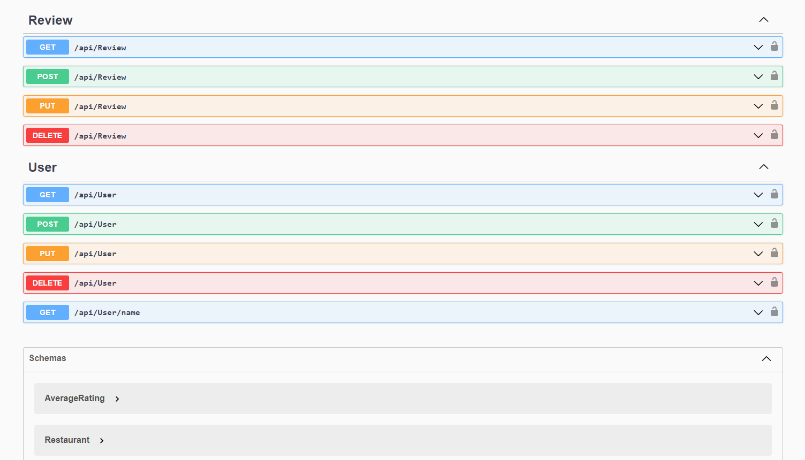

# Restaurant-Reviews

The Restaurant Reviews application allows a user to provide and look up reviews for different restaurants. This would help people to give their opinion, and it will help others at the time of choosing a restaurant to visit. Users can see the basic information of a restaurant and the average rating for each restaurant from all the reviews available. Also, it is possible to sort the restaurants according to their average ratings and names. A person can also search a particular restaurant by its name, zip code, or state. Restaurant and review records can all be edited or deleted.

## Technologies Used
* C#
* ASP.NET
* MVC
* SQL Server
* ADO.NET Entity Framework
* HTML
* JavaScript
* CSS
* Microsoft Azure
* Bootstrap
* DevOps

## Features

List of features ready and TODOs for future development

* Ability for Admin to add Restaurant
* Ability to Add users to Database
* Ability for users to add reviews

To-do list:

* Allow user to login as the user

## Getting Started

> The code will only run if you create a database with the tables using the sql queries provided in the repository folder called SQLQueries. 
> These commands work on Visual Studio Code

* git clone https://github.com/Daniel2320/Restaurant-Reviews.git
* To use the database create the SQL server table using the queries available in the SQLQueries folder
* Once created you must add your connection string to a appsettings.json folder
* To run the API you must run the application in Visual Studio
* Open the sln file in the project with visual studio
* The program can now run
* Swagger will then run and you can go through the methods

## Images of Application

## License

This project uses the following license:MIT License.
